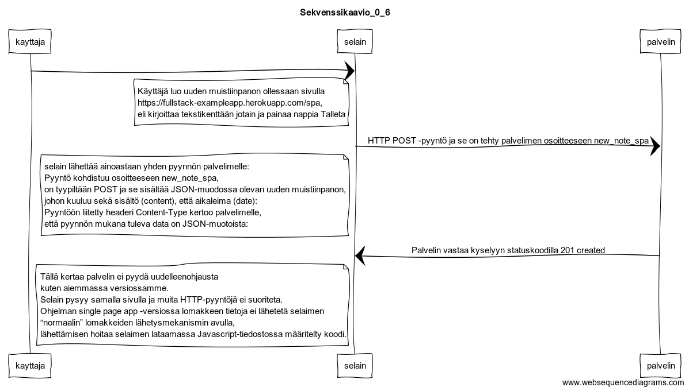

# Osa-0

## web-sovellusten perusteet

### 0.3 muistiinpanojen sivu

title Sekvenssikaavio_0_3

kayttaja->selain:

note left of selain\
kayttaja kirjottaa osoiteriville\
<https://fullstack-exampleapp.herokuapp.com/notes>\
end note

selain->palvelin: GET <https://fullstack-exampleapp.herokuapp.com/notes>

note left of selain\
HTML-koodin head-osio sisältää script-tagin,
jonka ansiosta selain lataa main.js-nimisen
Javascript-tiedoston palvelimelta\
end note

palvelin->selain: status 200, sivun HTML-koodi Content-Type: text/html;\
selain->palvelin: GET <https://fullstack-exampleapp.herokuapp.com/main.css>\
palvelin->selain: status 200, main.css Content-Type: text/css;\
selain->palvelin: GET <https://fullstack-exampleapp.herokuapp.com/main.js>\

note left of selain\
Heti ladattuaan script-tagin sisältämän
Javascriptin selain suorittaa koodin.\
end note

palvelin->selain: status 200, main.js Content-Type: application/javascript;\
selain->palvelin: selain tekee GET-tyyppisen HTTP-pyynnön palvelimen osoitteeseen /data.json

note left of selain\
Muistiinpanojen sivun Javascript-koodi
lataa muistiinpanot sisältävän JSON-muotoisen datan
ja muodostaa datan avulla selaimeen “bulletlistan” muistiinpanojen sisällöstä\
end note

palvelin->selain: status 200, Content-Type: application/json;

note left of selain\
Selain naytta palvelimen palauttaman HTMLkoodin joka on muotoiltu main.css:n mukaiseksi\
end note

### 0.4 Uusi muistiinpano

title Sekvenssikaavio_0_4

kayttaja->selain:

note left of selain\
Käyttäjä luo uuden muistiinpanon ollessaan sivulla
<https://fullstack-exampleapp.herokuapp.com/notes>,
eli kirjoittaa tekstikenttään jotain ja painaa nappia Talleta\
end note

selain->palvelin: HTTP POST -pyyntö ja se on tehty palvelimen osoitteeseen new_note

note left of selain\
  selain lähettää lomakkeelle syötetyn datan palvelimelle\
end note

palvelin->selain: Palvelin vastaa pyyntöön HTTP-statuskoodilla 302

note left of selain\
  Kyseessä on ns. uudelleenohjauspyyntö eli redirectaus
  minkä avulla palvelin kehottaa selainta tekemään automaattisesti
  uuden HTTP GET -pyynnön headerin Location kertomaan paikkaan,
  eli osoitteeseen notes.\
end note

selain->palvelin: GET <https://fullstack-exampleapp.herokuapp.com/notes>

note left of selain\
 Selain siis lataa uudelleen muistiinpanojen sivun.
 Sivunlataus saa aikaan myös kolme muuta HTTP-pyyntöä:
 tyylitiedoston (main.css), Javascript-koodin (main.js)
 ja muistiinpanojen raakadatan (data.json) lataamisen.\
end note

palvelin->selain: status 200, sivun HTML-koodi Content-Type: text/html;

selain->palvelin: GET <https://fullstack-exampleapp.herokuapp.com/main.css>\
palvelin->selain: status 200, main.css Content-Type: text/css;

selain->palvelin: GET <https://fullstack-exampleapp.herokuapp.com/main.js>

note left of selain\
 Heti ladattuaan script-tagin sisältämän
 Javascriptin selain suorittaa koodin.\
end note

palvelin->selain: status 200, main.js Content-Type: application/javascript;

selain->palvelin: selain tekee GET-tyyppisen HTTP-pyynnön palvelimen osoitteeseen /data.json

note left of selain\
Muistiinpanojen sivun Javascript-koodi
lataa muistiinpanot sisältävän JSON-muotoisen datan
ja muodostaa datan avulla selaimeen “bulletlistan” muistiinpanojen sisällöstä\
end note

palvelin->selain: status 200, Content-Type: application/json;

note left of selain\
Selain naytta palvelimen palauttaman HTMLkoodin joka on muotoiltu main.css:n mukaiseksi\
end note\

### 0.5 Single page app

title Sekvenssikaavio_0_5

kayttaja->selain:

note left of selain\
kayttaja kirjottaa osoiteriville
<https://fullstack-exampleapp.herokuapp.com/spa>\
end note

selain->palvelin: GET <https://fullstack-exampleapp.herokuapp.com/spa>

note left of selain\
pääsivu toimii perinteisten web-sivujen tapaan:
kaikki sovelluslogiikka on palvelimella
ja selain ainoastaan renderöi palvelimen lähettämää HTML-koodia.\
end note

palvelin->selain: status 200, sivun HTML-koodi Content-Type: text/html;

note left of selain\
  HTML-koodin head-osio sisältää script-tagin,
  jonka ansiosta selain lataa spa.js-nimisen
  Javascript-tiedoston palvelimelta\
end note

selain->palvelin: GET <https://fullstack-exampleapp.herokuapp.com/main.css>\
palvelin->selain: status 200, main.css Content-Type: text/css;

selain->palvelin: GET <https://fullstack-exampleapp.herokuapp.com/spa.js>\

note left of selain\
 Heti ladattuaan script-tagin sisältämän
 Javascriptin selain suorittaa koodin.\
end note

palvelin->selain: status 200, spa.js Content-Type: application/javascript;

selain->palvelin: selain tekee GET-tyyppisen HTTP-pyynnön palvelimen osoitteeseen /data.json

note left of selain\
Muistiinpanoista huolehtivassa sivussa osa sovelluslogiikasta,
eli olemassaolevien muistiinpanojen HTML-koodin generointi on siirretty selaimen vastuulle.
Selain hoitaa tehtävän suorittamalla palvelimelta lataamansa Javascript-koodin.
Selaimella suoritettava koodi hakee ensin muistiinpanot palvelimelta JSON-muotoisena raakadatana
ja lisää sivulle muistiinpanoja edustavat HTML-elementit DOM-apia hyödyntäen.\
end note

palvelin->selain: status 200, Content-Type: application/json;

note left of selain\
Selain naytta palvelimen palauttaman HTMLkoodin joka on muotoiltu main.css:n mukaiseksi\
end note

### 0.6 Uusi muistiinpano SPA:ssa

title Sekvenssikaavio_0_6

kayttaja->selain:

note left of selain\
Käyttäjä luo uuden muistiinpanon ollessaan sivulla
<https://fullstack-exampleapp.herokuapp.com/spa>,
eli kirjoittaa tekstikenttään jotain ja painaa nappia Talleta\
end note

selain->palvelin: HTTP POST -pyyntö ja se on tehty palvelimen osoitteeseen new_note_spa

note left of selain\
  selain lähettää ainoastaan yhden pyynnön palvelimelle:
  Pyyntö kohdistuu osoitteeseen new_note_spa,
  on tyypiltään POST ja se sisältää JSON-muodossa olevan uuden muistiinpanon,
  johon kuuluu sekä sisältö (content), että aikaleima (date):
  Pyyntöön liitetty headeri Content-Type kertoo palvelimelle,
  että pyynnön mukana tuleva data on JSON-muotoista:\
end note

palvelin->selain: Palvelin vastaa kyselyyn statuskoodilla 201 created

note left of selain\
  Tällä kertaa palvelin ei pyydä uudelleenohjausta
  kuten aiemmassa versiossamme.
  Selain pysyy samalla sivulla ja muita HTTP-pyyntöjä ei suoriteta.
  Ohjelman single page app -versiossa lomakkeen tietoja ei lähetetä selaimen
  “normaalin” lomakkeiden lähetysmekanismin avulla,
  lähettämisen hoitaa selaimen lataamassa Javascript-tiedostossa määritelty koodi.\
end note

